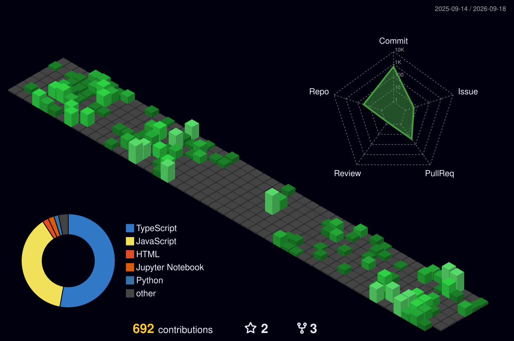

  

<!-- Profile Header -->
<h1 align="center">Hi 👋, I'm Krishna Singh</h1>
<h3 align="center">Full Stack Developer | ML & Data Enthusiast</h3>

  
  

<!-- Profile Trophies -->

  

---

### 🚀 About Me
- 🔭 I’m currently working on **Movie Booking Project**
- 🌱 I’m learning **OpenCV, DBMS, and Excel**
- 💬 Ask me about **Full-Stack Development, Problem Solving & ML**
- 📫 Reach me at **0.krishna1120@gmail.com**
- ⚡ Fun fact: **I don’t have a hobby (yet 😅)**

---

### 🌐 Connect With Me

  
  
  
  
  

---

### 🛠️ Languages & Tools  

#### 🌐 Frontend

  
  
  
  
  
  

#### ⚙️ Backend

  
  
  

#### 🗄️ Databases

  
  
  
  

#### 🤖 AI / ML

  
  
  
  
  

#### 🛠️ Tools & Others

  
  
  

---

### 🚀 Featured Projects
- 🎬 <a href="https://github.com/kri01ceram/movie-booking"><b>Movie Booking System</b></a> – A full-stack MERN app for booking movies.  
- 🧠 <a href="https://github.com/kri01ceram/ml-projects"><b>ML Projects Collection</b></a> – Machine learning & AI experiments.  
- ⚡ <a href="https://github.com/kri01ceram/portfolio"><b>Portfolio Website</b></a> – Next.js & TailwindCSS personal portfolio.  

---

### 🏆 Achievements
- 🥇 **1250+ Rating** @ Codeforces  
- 💡 Solved **300+ DSA problems** @ LeetCode  
- 🎯 Active **Open Source Contributor**  
- 🏅 Consistently building **full-stack + ML projects**  

---

## 🧊 Contributions

  <!-- This file is generated by the workflow below -->
  

---

Made with ❤️ by Krishna Singh

